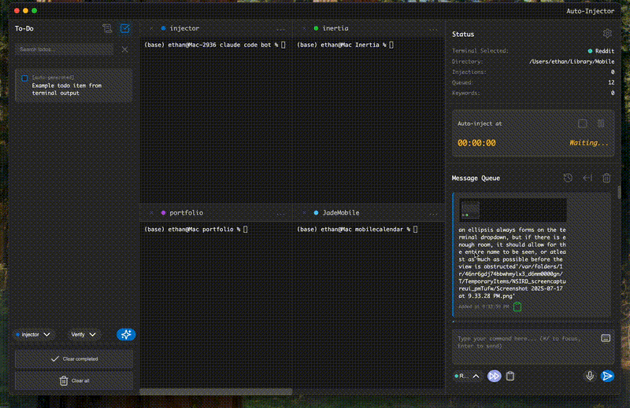
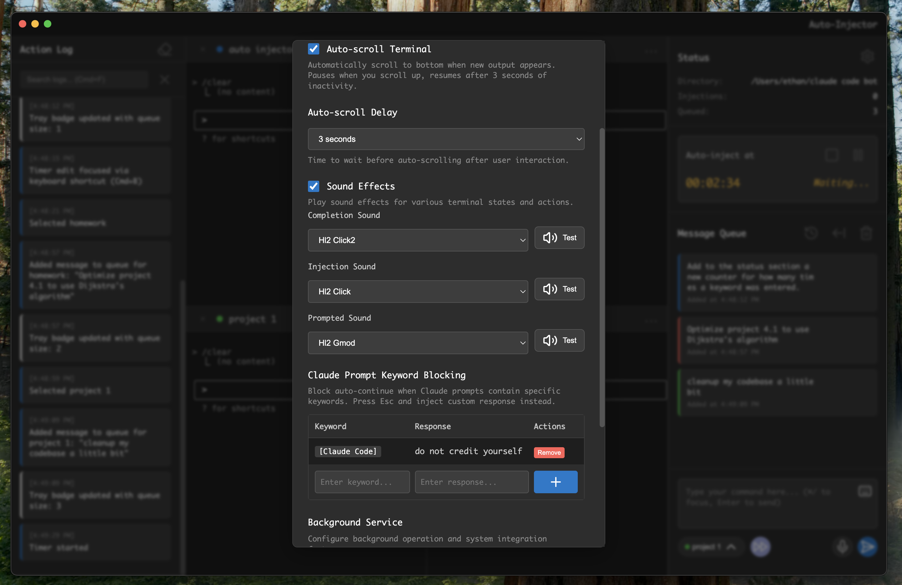

# Auto-Injector: Advanced Terminal Automation Suite

This is a tool that enhances the Claude Code terminal experience. Queue messages, convert speech to prompts, smart auto-continue with keyword detection, completion sounds and more!

Now introducing *Advanced Plan Mode* which intuitively utilizes Claude Flow for better propmt execution.



## 🌟 Revolutionary Features



## 🚀 Quick Start Guide

### Prerequisites
- **Node.js** v16+ and npm
- **macOS** 10.15+, **Windows** 10+, or **Linux** with X11
- **Microphone access** for voice features (optional)

### Installation

#### Option 1: Standalone Only (Basic)
```bash
# Install dependencies
npm install

# Start the application
npm start
```

#### Option 2: With Django Backend (Advanced)
For enhanced functionality including persistent memory, voice processing, and advanced features:

```bash
# Install dependencies
npm install

# Set up Django backend
cd backend
python3 -m venv venv
source venv/bin/activate
pip install -r requirements.txt
python manage.py migrate

# Start both backend and frontend (with waiting for backend)
cd ..
./start_with_backend.sh
```

## 📄 License

MIT License - Free for personal and commercial use.

## 🙏 Acknowledgments

- Terminal emulation powered by [xterm.js](https://xtermjs.org/)
- Voice transcription via [OpenAI Whisper](https://openai.com/whisper)
- Icons by [Lucide](https://lucide.dev/)
- Sound effects from Half-Life 2

---