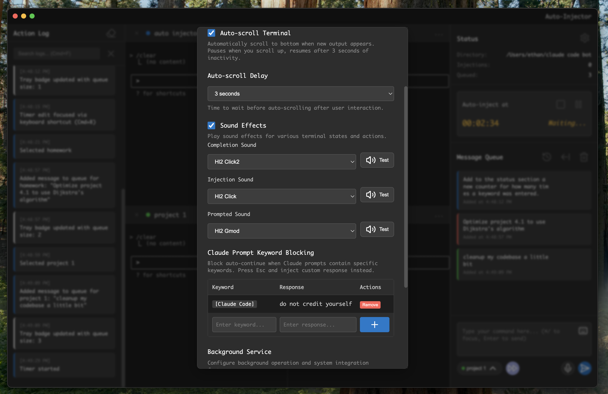

# Auto-Injector

Runs multiple Claude Code sessions in a single window and queues messages for each terminal, injecting them automatically when that terminal is free.


## Features

- Terminal grid for running Claude Code across many projects at once
- Per-terminal message queue — write prompts now, they inject when the terminal goes idle
- State detection via Claude Code hooks (running / prompted / idle), not output scraping. The hooks install automatically and only activate inside app-spawned terminals
- Injection timer that backs off when Claude hits a usage limit and resumes when it lifts
- Per-terminal sound notifications for completions and permission prompts
- Voice-to-prompt: record, transcribe with local Whisper, append to the message input (requires the backend; experimental)
- Token usage and cost tracking via the bundled Django backend



## Install

```bash
git clone https://github.com/streylix/claude-autorunner.git
cd claude-autorunner
./start.sh --setup   # first run: installs deps, creates venv, runs migrations
./start.sh           # every run after that
```

Frontend only (no voice/pricing features):

```bash
npm install
npm start
```

Requires Node.js 16+ and Python 3.10+ for the backend. macOS 10.15+, Windows 10+, or Linux with X11.

## License

MIT

## Acknowledgments

- Terminal emulation by [xterm.js](https://xtermjs.org/)
- Voice transcription via [OpenAI Whisper](https://openai.com/whisper)
- Icons by [Lucide](https://lucide.dev/)
- Sound effects from Half-Life 2
