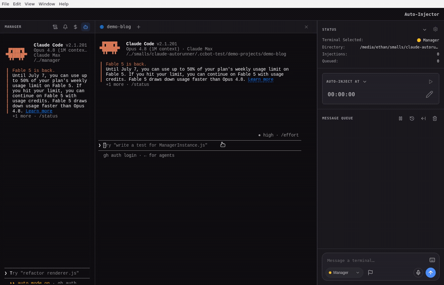
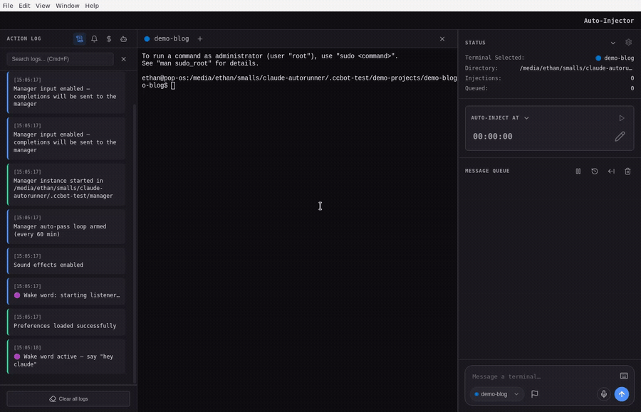
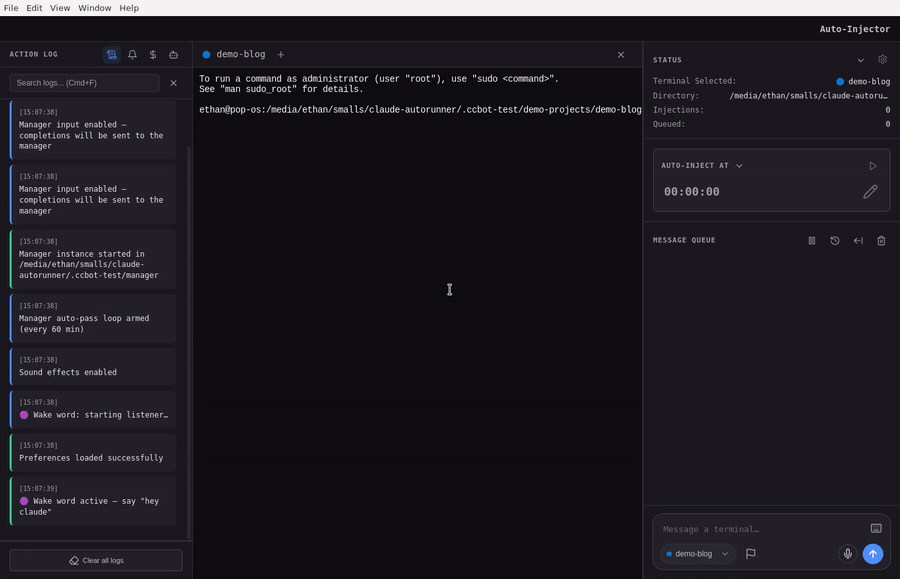

# Auto-Injector

Run a fleet of Claude Code sessions in one window — a grid of terminals with a
message queue that injects prompts the moment each terminal goes idle, a hidden
"manager" Claude instance that steers the whole interface, and a voice layer
(wake word, push-to-talk, spoken notifications) so you can drive it all
hands-free.


## Features

### Terminals & queueing
- **Terminal grid** — run Claude Code across many projects side-by-side
  (xterm.js + node-pty), with per-terminal colors, titles, search
  (Cmd+F / Ctrl+Shift+F), and a chunked layout for large fleets.
- **Message queue** — write prompts now; they inject when the target terminal
  is free. Normal/urgent priorities, drag-drop or paste file attachments
  (referenced by absolute path), full CRUD on queued messages.
- **State detection via Claude Code hooks, not output scraping** — three
  guarded hooks (Stop / Notification / UserPromptSubmit) are installed
  automatically and only activate inside app-spawned terminals, so your other
  Claude sessions are never affected.
- **Usage-limit handling** — detects the limit notification, counts down to
  the reset, holds all injection, and resumes on its own.
- **Auto-inject timer** — schedule the queue to start flushing later (e.g.
  when a usage window resets).

### The Manager (terminal 999)
- A real `claude` CLI session in a hidden PTY that **monitors and steers the
  interface** through a token-authed local control API: it reads every
  terminal's status, queues work to them, and answers their permission
  prompts.
- **Recurring optimization passes** — on an interval (default 60 min) the
  manager runs a standing instruction against the routines in its own
  directory. Toggle + interval live in Settings.
- **Completion reports** — finished terminals are reported to the manager,
  which decides what to summarize and announce.

### Voice
- **"Hey Claude" wake word** — always-on, fully local (Vosk WASM in the
  renderer). Speak the phrase, a chime confirms, your command is captured,
  transcribed once by Whisper, and lands in the manager's queue as an urgent
  voice memo. Works while the app is hidden. Strictness and silence cutoff are
  tunable in Settings; the ~39 MB Vosk model downloads on first run.
- **Push-to-talk voice-to-prompt** — click the mic, speak, and the Whisper
  transcription appears in the message input, editable before sending.
- **Spoken notifications (TTS)** — the manager summarizes completions and the
  app reads them aloud (Kokoro), with a Notifications tab to replay history.
  Notifications pause while you're speaking and resume where they left off.
- **Sound effects** — per-event and per-terminal override sounds.

### Tracking, logging, misc
- **Token/cost tracking** — `ccusage` runs on the host against your local
  Claude Code logs; the Pricing view shows daily/weekly/total estimates.
- **One merged log stream** — every user-visible action renders in the
  sidebar Action Log *and* ships to the backend, so
  `docker compose logs -f backend` interleaves frontend + Django activity in
  a single timeline.
- System tray (queue badge, start/stop injection), optional keep-screen-awake
  while injecting, theme support.

## In action

**The Manager steering the fleet** — ask it to check state and hand work to a
terminal; it reads the control API, queues the task, and the terminal picks it
up:



**"Hey Claude" wake word** — spoken hands-free, transcribed locally, forwarded
to the manager as an urgent memo:



**Push-to-talk voice mode** — click the mic, speak, and the Whisper
transcription lands in the message input ready to send:



## How it works

Three processes:

1. **Electron main** — owns the PTYs, the system tray, persistence, and a
   loopback **HookServer** (random port, per-session token). Every PTY it
   spawns carries `CCBOT_*` env vars; the Claude Code hooks POST state changes
   back to it, which is how the app knows a terminal is running / prompted /
   idle without parsing output.
2. **Electron renderer** — the UI: an event-bus architecture with one manager
   module per feature (queue, status, sounds, voice, wake word, timer, TTS
   notifications, usage limit…).
3. **Django backend** (Docker, port 8123) — Whisper transcription, Kokoro TTS,
   the wake-word check endpoint, queue persistence, and the merged log sink.

The manager instance is the same trick turned inward: a Claude session whose
"tools" are the control API — `GET /state` to see the fleet,
`POST /queue/add` to hand work to a terminal.

## Install & run

```bash
git clone https://github.com/streylix/claude-autorunner.git
cd claude-autorunner
./start.sh   # Django + Postgres in Docker (port 8123, migrations applied), then the app
```

Docker is the default backend. No Docker? Force the local-venv mode with
`./start.sh --venv` (run `./start.sh --setup` once first to create the venv
and install dependencies).

Frontend only (no voice / TTS / pricing):

```bash
npm install
npm start
```

Requires Node.js 16+; Python 3.10+ only for the venv backend mode.
macOS 10.15+, Windows 10+, or Linux with X11. TTS voice synthesis uses
espeak-ng phonemes (installed inside the Docker image; install it yourself for
the venv mode).

## Configuration highlights

Everything lives in **Settings** (gear icon):

- **Wake word** — enable/disable, the phrase itself, match strictness,
  end-of-speech silence, activation/stop sounds, microphone device.
- **Manager** — completions-to-manager toggle, permission-prompt answering,
  recurring pass toggle + interval.
- **Spoken notifications** — preferred Kokoro voice, playback speed, autoplay.
- **Sounds** — per-event sound selection with test buttons.
- The manager's working directory (and therefore its routines and role) is set
  via the Manager view.

## Discord voice bridge (`discord-integration` branch)

The `discord-integration` branch adds a standalone bridge service that puts
the manager in a Discord voice channel: speak the wake word in the call and
your words reach the manager; its TTS replies stream back into the channel,
and a text channel mirrors the conversation ("Heard:" / "Replied:") with
image/video hand-off in both directions.

Security posture: the bridge holds **no app credentials at rest** (a
rotatable link-key + 0600 local vault), reaches the app only over loopback,
and **denies everyone by default** — you must allow-list Discord user IDs
(`DISCORD_ALLOWED_USER_IDS`) before anyone can drive it.

Start with [`discord-bridge/DISCORD_SETUP_GUIDE.md`](./discord-bridge/DISCORD_SETUP_GUIDE.md)
(bot provisioning from zero) and [`discord-bridge/SETUP.md`](./discord-bridge/SETUP.md)
(architecture, linking, security model).

## License

MIT

## Acknowledgments

- Terminal emulation by [xterm.js](https://xtermjs.org/)
- Voice transcription via [OpenAI Whisper](https://openai.com/whisper)
- Wake word by [Vosk](https://alphacephei.com/vosk/)
- Text-to-speech by [Kokoro](https://github.com/hexgrad/kokoro)
- Icons by [Lucide](https://lucide.dev/)
- Sound effects from Half-Life 2
