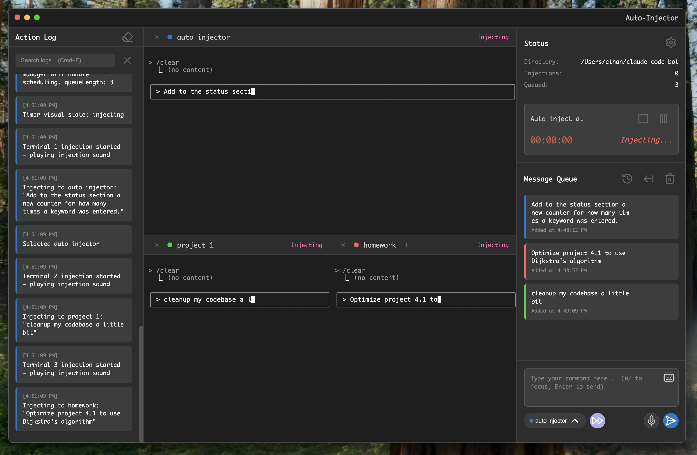

# Auto-Injector: Advanced Terminal Automation Suite

This is a tool that enhances the Claude Code terminal experience. Queue messages, convert speech to prompts, smart auto-continue with keyword detection, completion sounds and more!



## 🌟 Revolutionary Features


### 🎤 **Voice-to-Text Transcription**
Transform spoken commands into queued terminal instructions with state-of-the-art voice recognition powered by OpenAI's Whisper model.

- **One-click voice recording** with visual feedback
- **Automatic transcription** using advanced AI models
- **Smart punctuation** and command formatting
- **Multi-language support** for international workflows
- **Noise cancellation** for clear command capture

### 🖥️ **Multi-Terminal Orchestration**
Manage and coordinate multiple terminal sessions simultaneously with intelligent routing and visual organization.

- **Unlimited terminal sessions** with color-coded identification
- **Smart message routing** to specific terminals
- **Terminal-specific queue targeting** for complex workflows
- **Visual terminal status indicators** (idle, busy, prompting)
- **Synchronized command execution** across terminals
- **Round-robin and manual terminal assignment**

### 🤖 **AI Usage Limit Detection**
Intelligent detection and handling of Claude AI's usage limits with automatic recovery mechanisms.

- **Automatic usage limit detection** from Claude's responses
- **Smart queue preservation** during rate limits
- **Countdown timer synchronization** with Claude's reset time
- **Automatic resume** when limits reset
- **Visual progress indicators** for limit recovery
- **Queue state persistence** across limit events

### 🔊 **Advanced Sound Cue System**
Professional audio feedback system with context-aware notifications and customizable sound profiles.

- **Completion notifications** when injection sequences finish
- **Terminal idle detection** for accurate timing
- **Half-Life 2 themed sound pack** included
- **Custom sound import** support

### 🚫 **Intelligent Keyword Blocking**
Sophisticated keyword detection system preventing unwanted auto-continuation and protecting against dangerous operations.

- **Real-time keyword scanning** in terminal output
- **Customizable blocking rules** with regex support
- **Automatic response injection** for blocked prompts
- **Visual blocking indicators** in the action log
- **Default safety keywords** pre-configured
- **Override capabilities** for trusted operations

### ⚡ **Smart Auto-Continue Evolution**
Next-generation auto-continue system that intelligently processes entire workflows while respecting safety boundaries.

**Intelligent Processing:**
- Automatically continues through ALL prompts and confirmations
- Detects and respects keyword-blocked scenarios
- Handles multi-step installations and configurations
- Manages interactive command sequences
- Preserves user safety with smart boundaries

**Advanced Features:**
- **Trust prompt detection** for elevated operations
- **Usage limit awareness** with pause/resume
- **Multi-terminal coordination** during auto-continue
- **Visual status tracking** of auto-continue state
- **Emergency stop** capabilities (Escape key)

## 🚀 Quick Start Guide

### Prerequisites
- **Node.js** v16+ and npm
- **macOS** 10.15+, **Windows** 10+, or **Linux** with X11
- **Microphone access** for voice features (optional)

### Installation
```bash
# Clone the repository
git clone https://github.com/yourusername/auto-injector.git
cd auto-injector

# Install dependencies
npm install

# Start the application
npm start
```

### First Run Setup
1. **Launch the app** - Terminal will initialize automatically
2. **Grant permissions** - Allow terminal and microphone access when prompted
3. **Configure settings** - Access via the gear icon
4. **Test voice input** - Click the microphone button and speak a command
5. **Create first automation** - Type or speak commands to queue

## 🔧 Keyboard Shortcuts

| Shortcut | Action |
|----------|--------|
| `Ctrl+I` | Inject next message immediately |
| `Ctrl+Shift+V` | Toggle voice transcription |
| `Ctrl+T` | Create new terminal |
| `Ctrl+1-4` | Switch message context to terminal 1-4 |
| `Shift + Tab` | Toggle auto-continue |
| `Ctrl+P` | Play/pause timer |

## 🏗️ Architecture Overview

### Core Components
- **Main Process**: Electron main process managing system integration
- **Renderer Process**: React-like terminal GUI with state management  
- **Terminal Engine**: node-pty based terminal emulation
- **Voice Engine**: Whisper API integration for transcription
- **Queue Manager**: Sophisticated FIFO processing with timing
- **Injection System**: Character-by-character typing simulation

### Data Flow
```
Voice Input → Transcription → Message Queue → Injection Manager → Terminal
     ↓              ↓               ↓               ↓              ↓
Microphone → Whisper API → Processing → Scheduling → Execution → Output
```

## 🛡️ Security & Privacy

### Security Features
- **Keyword blocking** prevents dangerous commands
- **Terminal sandboxing** for isolated execution
- **No cloud dependency** - runs entirely locally
- **Encrypted preferences** storage
- **Session isolation** between terminals

### Privacy Commitment
- Voice data processed locally when possible
- No telemetry or usage tracking
- All automation data stays on your machine
- Open source for full transparency

## 🤝 Contributing

We welcome contributions! See our [Contributing Guide](CONTRIBUTING.md) for details.

### Development Setup
```bash
# Development mode with hot reload
npm run dev

# Run tests
npm test

# Build for distribution
npm run build
```

## 📄 License

MIT License - Free for personal and commercial use.

## 🙏 Acknowledgments

- Terminal emulation powered by [xterm.js](https://xtermjs.org/)
- Voice transcription via [OpenAI Whisper](https://openai.com/whisper)
- Icons by [Lucide](https://lucide.dev/)
- Sound effects from Half-Life 2

---